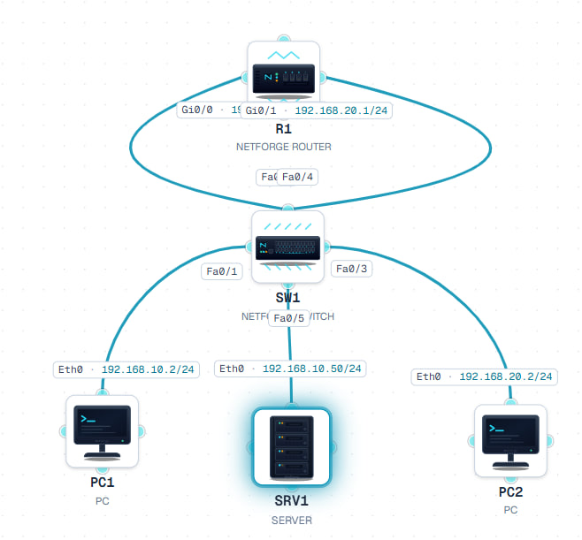

# NAC Networking Lab

A small network lab I built while learning NAC and basic network support.

## Lab

[Open the lab in NetForge](https://www.netforge-ai.com/t/dNVoFroDcN)

## Network Topology

## What I built

- Staff and Guest VLANs
- IP addressing and subnetting
- DHCP for clients
- Inter-VLAN routing
- Basic network connectivity testing
- MAC address and switch-port checking
- ACL-based access control
- Guest-to-Staff traffic blocking

## Network

- PC1 – Staff – VLAN 10
- PC2 – Guest – VLAN 20
- SRV1 – DHCP Server
- SW1 – Layer 2 Switch
- R1 – Router

## NAC concepts I practiced

- AAA
- RADIUS
- 802.1X
- MAB
- Guest access
- Access control policies
- Basic NAC troubleshooting

## Troubleshooting example

Guest PC was initially able to reach the Staff network.

I created an ACL on the router to block:

Guest VLAN 20 → Staff VLAN 10

After applying the policy, the Guest PC could no longer reach the Staff PC, while it could still reach its own gateway.

## Tools

- NetForge lab
- Networking CLI
- GitHub
